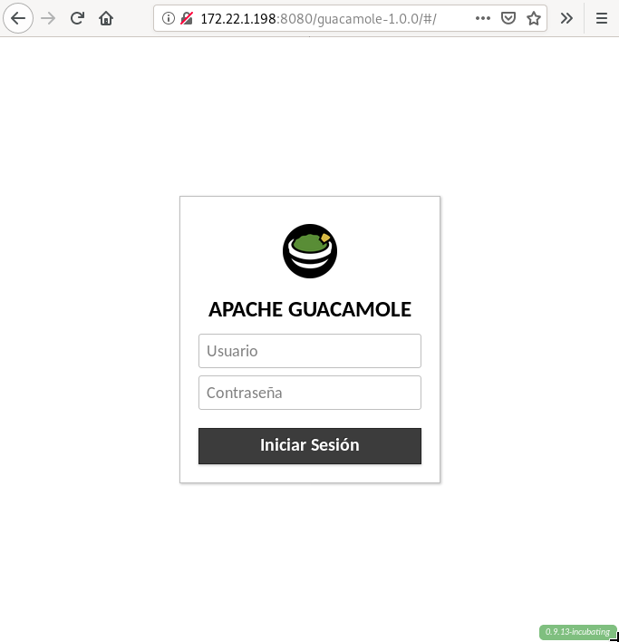
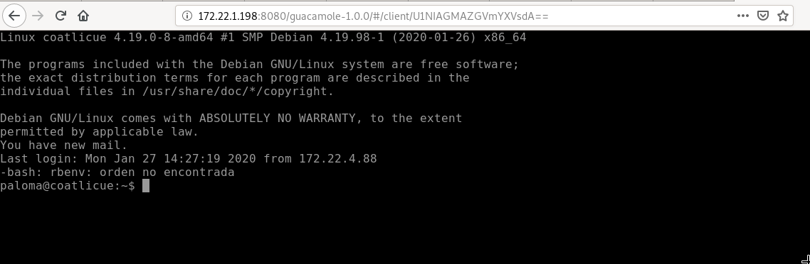

# Despliegue de CMS java
En esta práctica vamos a desplegar un CMS escrito en java. Puedes escoger la aplicación que vas a desplegar de CMS escritos en Java o de Aplicaciones Java en Bitnami.

Se evaluará la complejidad de la instalación (por ejemplo, necesidad de tener que instalar un conector de base de datos, …), ejemplo de puntuación (de un máximo de 10 puntos):

**Indica la aplicación escogida y su funcionalidad.**
Se va a utilizar **Gaucamole** y para el despliegue **Tomcat**. 

**Escribe una guía de los pasas fundamentales para realizar la instalación.**
#### Instalación de Tomcat
Se instala el paquete **tomcat8**:
~~~
vagrant@servidor:~$ sudo apt install tomcat9
~~~

#### Instalación de Apache Guacamole
**Instalación de Guacamole Server**
Para instalar Guacamole Server se descarga desde la [página oficial de Guacamole](https://guacamole.apache.org/releases/1.0.0/) y se compila:
~~~
vagrant@servidor:~$ wget http://archive.apache.org/dist/guacamole/1.0.0/source/guacamole-server-1.0.0.tar.gz
vagrant@servidor:~$ tar -xvf guacamole-server-1.0.0.tar.gz 
vagrant@servidor:~$ cd guacamole-server-1.0.0/
vagrant@servidor:~/guacamole-server-1.0.0$ ./configure --with-init-dir=/etc/init.d
~~~

Se compila e instala:
~~~
vagrant@servidor:~/guacamole-server-1.0.0$ make
vagrant@servidor:~/guacamole-server-1.0.0$ sudo make install
vagrant@servidor:~/guacamole-server-1.0.0$ sudo ldconfig
~~~

**Instalación de Guacamole Client**
De nuevo se recurre a la [página oficial de Gacamole](https://guacamole.apache.org/releases/1.0.0/) en esta ocasión para descargar el cliente:
~~~
vagrant@servidor:~$ wget http://archive.apache.org/dist/guacamole/1.0.0/binary/guacamole-1.0.0.war
~~~

Se copia en el directorio de Tomcat:
~~~
vagrant@servidor:~$ sudo cp guacamole-1.0.0.war /var/lib/tomcat9/webapps/
~~~

**¿Has necesitado instalar alguna librería?¿Has necesitado instalar un conector de una base de datos?**
**Dependencias**
Se necesitan las siguientes dependencias:
- Obligatorias:
~~~
libcairo2-dev libjpeg62-turbo-dev libpng-dev libossp-uuid-dev libtool
~~~

- Opcionales:
~~~
libavutil-dev libswscale-dev libpango1.0-dev libssh2-1-dev libtelnet-dev libvncserver-dev libpulse-dev libssl-dev libvorbis-dev libwebp-dev 
~~~

**Entrega una captura de pantalla donde se vea la aplicación funcionando.**
Y en la URL <ip_server>:8080/guacamole-1.0.0 aparece la página de acceso:

**Realiza la configuración necesaria en apache2 y tomcat (utilizando el protocolo AJP) para que la aplicación sea servida por el servidor web.**
#### Configuración de Guacamole Server
Se crean los siguientes directorios:
~~~
vagrant@servidor:~$ sudo mkdir /etc/guacamole /usr/share/tomcat9/.guacamole
~~~

Y se crea el fichero **/etc/guacamole/guacamole.properties** con el siguiente contenido:
~~~
guacd-hostname: localhost
guacd-port: 4822
user-mapping: /etc/guacamole/user-mapping.xml
auth-provider: net.sourceforge.guacamole.net.basic.BasicFileAuthenticationProvider
basic-user-mapping: /etc/guacamole/user-mapping.xml
~~~

Se crea el enlace simbólico:
~~~
vagrant@servidor:~$ sudo ln -s /etc/guacamole/guacamole.properties /usr/share/tomcat9/.guacamole/
~~~

Y se mapean los usuarios en **/etc/guacamole/user-mapping.xml**:
~~~
<user-mapping>
        <authorize 
         username="vagrant" 
         password="63623900c8bbf21c706c45dcb7a2c083" 
         encoding="md5">
                <connection name="SSH">
                        <protocol>ssh</protocol>
                        <param name="hostname">172.22.0.242</param>
                        <param name="port">22</param>
                        <param name="username">paloma</param>
                </connection>
        </authorize>
</user-mapping>
~~~

Se le otorgan los permisos necesarios a Tomcat:
~~~
vagrant@servidor:~$ sudo chmod 600 /etc/guacamole/user-mapping.xml 
vagrant@servidor:~$ sudo chown tomcat:tomcat /etc/guacamole/user-mapping.xml 
~~~

Desde la máquina anfitriona se accede al servicio web de Guacamole y se introduce el usuario y la contraseña. A continuación, pide la contraseña del usuario al que se va a acceder y finalmente se accede a una terminal con el usuario que se ha indicado en el mapeo:

